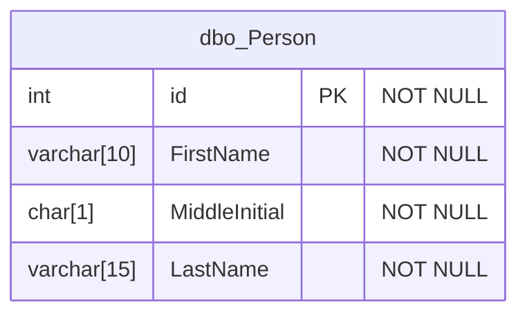
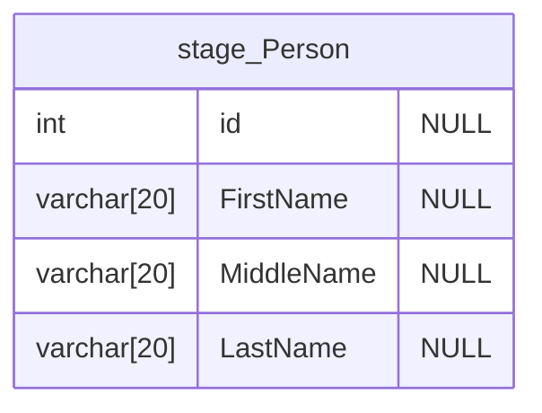
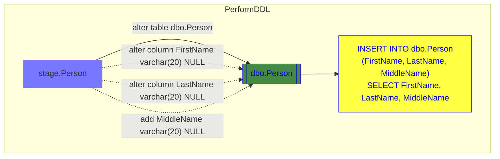
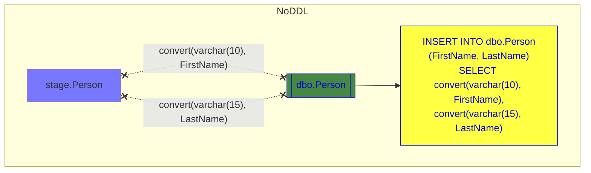

# SQL Server Schema Drift

## Purpose
When loading data to a SQL Server target table, it's possible that the schema of the data loaded does not match the schema of the target table.  Schema Drift functionality mitigates this as much as possible and provides the caller the option of expanding the target table to accomodate the incoming data, or converting the incoming data to fit the target schema.  
*The latter has the potential to truncate strings or lose precision in other data types*

## Requirements
Nothing is required of the data source.
The following objects must exist in the target database:
* [`audit.SchemaDrift`](/SqlScripts/SchemaDrift/audit.SchemaDrift.sql) - table to hold log of changes
    * [`history.SchemaDrift`](/SqlScripts/SchemaDrift/audit.SchemaDrift.sql) - table is recommended for audit history 
* [`utfGetTableDefinition`](/SqlScripts/SchemaDrift/utfGetTableDefinition.sql) - function which provides the columns, their types & parameters, etc.
* [`uspConformTable`](/SqlScripts/SchemaDrift/uspConformTable.sql) - stored procedure to compare the source and target tables.  Depending on user supplied parameters, this will return an INSERT statement comprised of either
    * converts source fields to fit target columns OR
    * runs DDL on the target table to expand fields with smaller data type configuration and provides a SELECT clause with the fields as they are

## Limitations
* Column matching is performed on exact name 
    * Case-sensitivity is dependent on database collation setting
    * Column order / sys.columns.column_id is disregarded, meaning different column ordering between tables is tolerated
* Source columns defined as string types (varchar, nvarchar, text, etc.) going to target columns of other type (datetime, int, real, etc.) are NOT handled
* Target NOT NULL is not supported.  Any DDL changes to target column will specify NULL allowed.
* There is no column-by-column option - either all smaller columns are expanded, or all source columns are converted.
* Any columns in the target table which are not present in the source table will be ignored
    * New rows either receive default values defined on the soure table or NULL
* Columns present in the source table which do not exist in the destination will be added if Perform DDL is set to 1; otherwise they are ignored in the generated INSERT
* Geometry, Geography, hierarchyid, timestamp types are allowed to move to same type or to a string type, but this is not thoroughly tested or confidently supported.
* The generated INSERT statement has no WHERE, GROUP BY, etc. clauses; any needed clauses must be added by the caller.

## Useage Pattern
The __target table__ assumed to be a user-accessible 'final' table (fact, dimension, etc.)  
The __source table__ is assumed to be a partial data set / *stage* table (a day of incremental data, a one-time or infrequent manual upload, etc.)

1. The source table will have been loaded as a stage table and its schema determined by the source or the data itself.
1. Call `uspConformTable` supplying source and target schema and table names as well as an options parameter with `{"Perform DDL": 1}` or `{"Perform DDL": 0}`.
1. Catch the returned `INSERT INTO <table> (...) SELECT ...` statement and either execute as is or modify with additional clauses

## Sample

